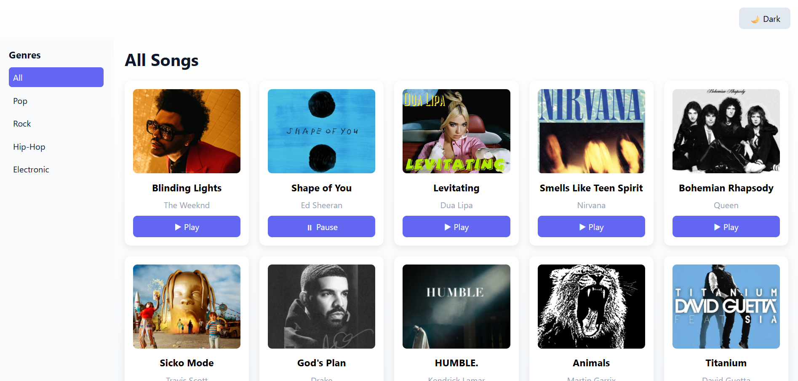
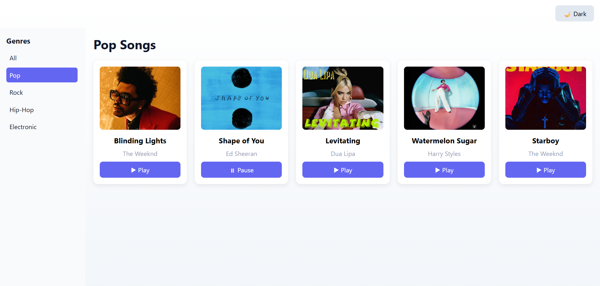
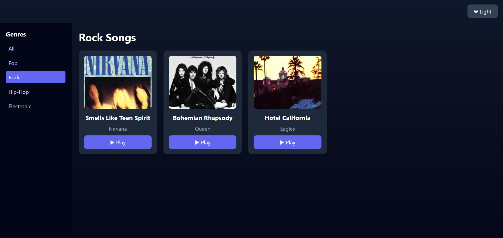
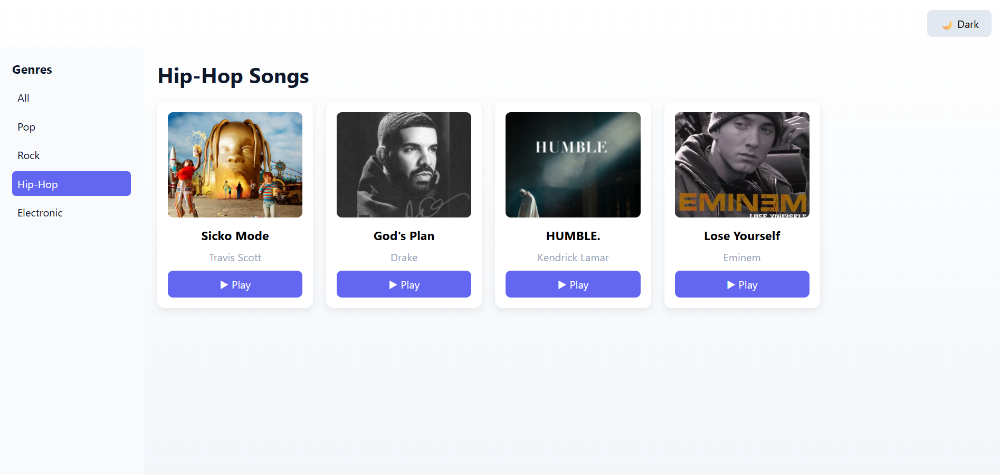
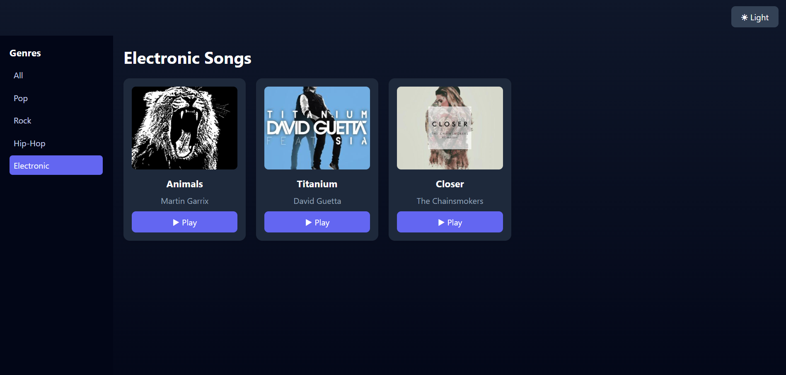
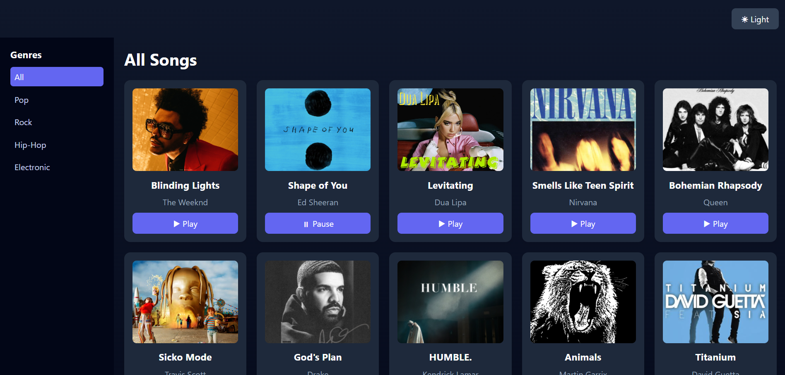
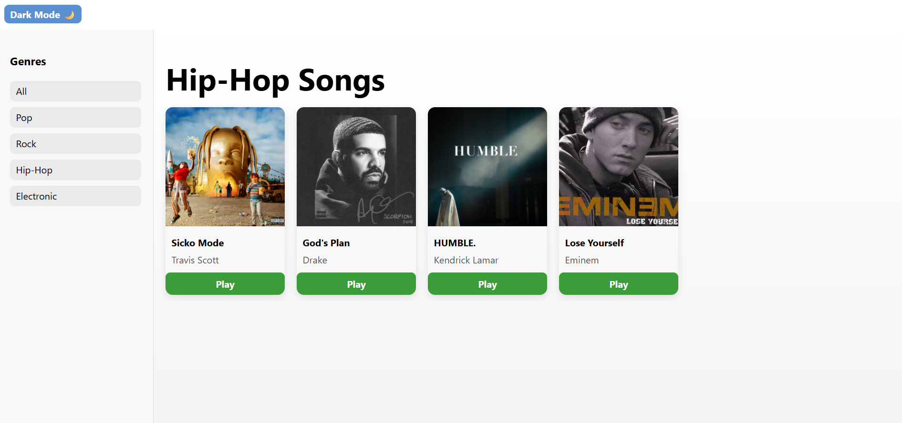
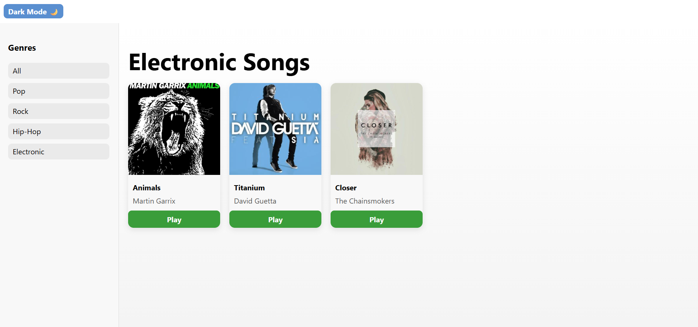

# 🎵 Music App
# Using Zustand
This is a simple Spotify-like music application built using React and Zustand.

---

## Features

- Play / Pause songs
- Genre based song filtering
- Light & Dark theme toggle
- Global state management using Zustand
- Persistent state (last played song, selected genre)
- Responsive and clean UI

---

## Tech Stack

- React (Vite)
- Zustand
- JavaScript
- CSS

---

## Screenshots
### Home Page

### Genre Page

### Dark Mode

---

# without zustan
This is a simple Spotify-like music application built using **React** and **Vite**.  
The app displays songs in a clean, responsive interface with genre-based filtering.

---

## ✨ Features

- Responsive music UI
- Genre filtering (Pop, Rock, Hip-Hop, etc.)
- Interactive song cards with play button
- Light & Dark mode support
- Uses local images for song covers
- Clean and professional layout

---

## 🛠️ Technologies Used

- React
- Vite
- JavaScript
- CSS (inline styling)

---

## 📸 Screenshots

### Home Page

### Genre Page

### Dark Mode

---
